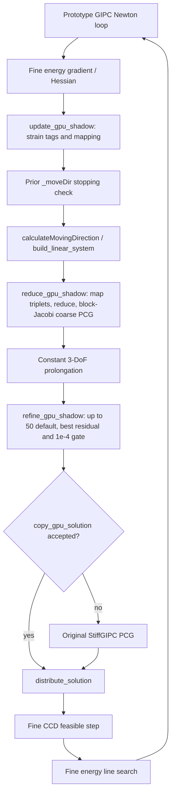

# Existing AGIPC code audit

2026-09-10. Audit only; no source modifications. Line ranges refer to the frozen commits below. `VERIFIED_REUSABLE` means the specified narrow property was inspected/tested, not that the entire simulation has passed A–G.

## Worktree identification

| Tree under 实验十三/code | Branch / HEAD | State at intake |
|---|---|---|
| Stiff-GIPC-c499-performance | stiffgipc/c499-performance-reproduction / 06b34e7dc6ba28339e4adffb48f260d959a269f1 | Tracked files clean; user-owned untracked cloth_129x129 assets and perf_diag preserved |
| Stiff-GIPC | agipc/performance-optimization / e5903cd2c94d12c96488419cf16ef6b86aea5589 | Clean; contains actual AGIPC prototype |
| Stiff-GIPC-c499-agipc | stiffgipc/c499-paper-benchmark | Existing dirty CMake/runtime/main/tests and untracked principal_stretch/steady_state headers; left untouched |

The intended starting branch is the first row. Its CLI has AGIPC options but **no adaptive solver implementation**. `GlobalLinearSystem::solve_linear_system` (143–159) unconditionally invokes `m_solver->solve`; `gl_main.cu` (1831–1834) can nevertheless write an AGIPC solver label. Consequently pre-existing labels alone are invalid evidence of reproduction.

Search evidence: `audit_search.txt`, a saved keyword scan of the baseline repository's nongenerated code/configuration and prototype StiffGIPC source. Searched agipc/coarse/mapping/matching/warp-hash/threshold/fine-correction/adoption/fallback. Bulky assets, build outputs, vendored libraries and immutable perf records excluded from content search. Additional CPU oracle and experiment scripts inspected separately.

## Current call graph

The prototype graph is not the baseline graph: baseline directly runs full PCG after assembly. Prototype mapping is called before its linear-system wrapper; coarse reduction uses `global_triplet_offset` rather than an explicitly unique fine BCOO count. Integration must verify the exact input representation.

## Component-by-component findings

Paths below beginning `StiffGIPC/` refer to the **prototype tree**, unless marked baseline.

| Classification | File / function / lines | Paper correspondence | Observed behavior and required action |
|---|---|---|---|
| SEMANTICALLY_WRONG | baseline `StiffGIPC/gipc/runtime_options.cpp:81–90`; `gl_main.cu:1831–1834`; `linear_system/linear_system/global_linear_system.cu:143–159` | Algorithm 1 lines 8–11 | AGIPC parses and labels output but never changes solver. Reject unavailable modes until real dispatch exists. |
| VERIFIED_REUSABLE | `agipc/agipc_coarsening.cu:140–241`, compute_tet_green_increment / compute_tri_green_increment | Main Eq.3 | Tensor formula and doubled off-diagonal squares match Frobenius definition by inspection. Reuse arithmetic only after independent Gate A GPU tests; no rod path. |
| INCOMPLETE | same file `243–268`, tag_edges | Main §4.2 | Tests `>=` instead of paper's exceeds `>`; NaN increment comparison can leave an edge collapsible; combines fixed boundary and missing-history protection. Add finite failure flag, exact threshold test and separate counters. |
| UNKNOWN | same file `118–123`, history_source; `821–826`, begin_gpu_shadow_frame; `828–890`, update_gpu_shadow | Previous Newton state in Eq.3 | Retains history across timestep boundary; it is last pre-line-search strain, not necessarily final accepted positions. Paper initialization not explicit. Establish reset/accepted-state convention and test before reuse. |
| VERIFIED_REUSABLE | same file `661–681`, add_edge; `738–819`, initialize_gpu_shadow | Main §4.2 static adjacency | Builds tet six-edge/triangle three-edge incident lists once. Verify FEM offsets in mixed scenes; preserve static lifetime. |
| SEMANTICALLY_WRONG | same file `366–421`, select_matching_candidates / apply_mutual_matches | Supplement Algorithms 1–2 | Default matching is fixed-round mutual edge selection, maximum aggregate 32; not recursive hash components. Keep only legacy diagnostic route. |
| INCOMPLETE | same file `286–304`, build_warp_hash_masks; `894–959`, hash hierarchy | Supplement Algorithms 1–2 | Optional warp mode remaps original tagged edges each level and composes maps; host reductions, fixed level cap and no-progress stop. Verify boundary/tail/fixed-point behavior; do not call this validated paper mapping. |
| SEMANTICALLY_WRONG | same file `306–335`, propagate_warp_components | Supplement Algorithm 2 | `__shfl_sync(active,...)` occurs inside per-lane variable `while(pending)`; named active lanes need not execute matching collectives. Replace with uniformly participating broadcasts or immutable shared hashes plus barriers, and test disconnected components/tail warps. Static CUDA contract defect; dynamic failure not yet reproduced. |
| VERIFIED_REUSABLE | same file `450–505`, map_triplets_to_coarse | Main §4.1 Galerkin | Explicit transpose on reversed order and B+B^T on collapsed off-diagonal preserve half-storage 3-DoF algebra by inspection. Reuse as reference for expanded mixed-block handling, not blind copying to full-storage matrices. |
| INCOMPLETE | same file `1048–1132`, reduce_gpu_shadow | Supplement §2 unique fine BCOO then second reduction | Uses raw global triplet count, local converter and allocated coarse matrix. Need explicit fine unique-count input and representation contract, independent relative-error tests. |
| INCOMPLETE | same file `507–531`, reduce_rhs_to_coarse; `624–640`, prolongate_solution | Main Eq.4 / §4.3 | Identity restriction/prolongation only; preserves prefix blocks. No rest-coordinate affine basis or mixed block indexing. |
| INCOMPLETE | `agipc/agipc_coarsening.cuh:8–100` stats; `.cu:47–109` State | Supplement Algorithms 3–4 | No 3/12 node classification, rest basis, n3 region or 1/4/16 expansion. `coarse/fine node` ratio is valid only for current pure translation FEM route. |
| SEMANTICALLY_WRONG | `.cu:53–61`, defaults; `1153–1224`, coarse PCG | Main §5 tolerance and preconditioner | Relative tolerance 1e-4 (squared 1e-8), block Jacobi, max min(512,DoF), not paper MAS/1e-3. Use explicit validated solver/preconditioner configuration. |
| INCOMPLETE | `.cu:1195–1199`, coarse curvature; `1388–1392`, post curvature | Gate E / SPD requirement | abs(pHp) rejects tiny denominators but allows significant negative curvature. Add signed positivity test and freeze diagnostic. |
| SEMANTICALLY_WRONG | `.cu:1351–1475`, refine_gpu_shadow; `1478–1489`, copy_gpu_solution | §4.3 and supplement post-coarsening | Requires best full-space relative residual <=1e-4 and coarse convergence before adoption; otherwise full solve. This changes limited post-correction semantics, can erase speed benefit. Remove this paper-mode acceptance requirement only after A–D/E diagnostics work; retain numerical-invalidity safeguards. |
| SEMANTICALLY_WRONG | `gl_main.cu:84–93`; `.cuh:102–111`; `.cu:683–711` configuration | Paper defaults | Default 5e-4/matching/post50, cap0 rejected. Paper mode needs 5e-5/hash/post10, with 0 allowed for ablation. Baseline CLI separately already has 5e-5/hash/post10 but is not connected. |
| UNKNOWN | `GIPC.cu:10979–11023`, Newton stopping | Main Algorithm1 line21 | dt factor exists, but prior _moveDir tested before current solve. Establish actual direction provenance/iteration indexing; do not claim current paper stopping equivalence. |
| INCOMPLETE | `linear_system/linear_system/global_linear_system.cu:60–166,234–258`; `GIPC.cu:11023–11093` | Fine contact, solve, CCD and line search | Fine collision pipeline remains, but absent mixed/contact tests do not establish preservation under coarsening. Pin same fine H/g for contact-map comparisons. |
| PERFORMANCE_ONLY_PROTOTYPE | `.cu:849–852,900–945,1009–1021,1128,1238,1445` | GPU-resident phase timings | Repeated events, per-level host Thrust results, DeviceSynchronize, allocation/resize. Optimize only after numerical gates. |
| INCOMPLETE | `.cu:1492–1644`, run_algebraic_self_test | Gate C | One 4-node SPD fixture tests swapped and collapsed blocks; compares max absolute H error <=1e-11, no mixed blocks or mapping GPU oracle. Strengthen to relative <=1e-12 over multiple fixtures. Not rerun on GPU this audit. |
| PERFORMANCE_ONLY_PROTOTYPE | `code/agipc_reference/agipc_core_reference.py:30–118` | A/B conceptual reference | Edge-length strain proxy and bounded CPU union-find, explicitly not paper criterion/hash algorithm. Must not be Gate A/B oracle. |
| VERIFIED_REUSABLE | same Python file `121–188`, build_restriction / galerkin_reduce / coarse_direction_with_post_correction | Translational Galerkin | Useful independent small 3-DoF reference. Existing test rerun PASS, but it does not invoke CUDA, tensor strain or mixed affine blocks. |

## Capacity fix correspondence

Official a5bf7e548529181f0222f773e6fe330e3b8d881c adds `requiredGoingNextCapacity`: round `max(vertex_count,mapped_node_count)` up to BANKSIZE, multiply by level count with overflow checks; bounds-check writes in PrefixSumLx and final cluster count.

Baseline `StiffGIPC/MASPreconditioner.cu:2292–2310` computes maxNodes but allocates d_goingNext with `vertNum*levelnum*sizeof(unsigned int)`. It retains the undersized pattern. Backport to its raw cudaMalloc interface if the exercised CEMAS route needs it; log it as a shared correctness prerequisite and retain the immutable baseline anchor. Do not import upstream DeviceBuffer/MAS refactors. Check 38386->38400 and grouped 1001/1024 domains as regressions; no large-scene run until capacity assumptions are verified.

## Current verification and limits

- GPU queried now: NVIDIA RTX3070 Laptop, 8192 MiB, driver 581.57; nvcc resolves to CUDA v13.0.
- Existing `build-short2/Release/gipc.exe --spmv-self-test`: exit0, PASS; 20 block rows, 210 triplets, SRBK/reference max absolute error 5.684341886080802e-14; Legacy/SRBK relative error 2.0532613956342335e-16.
- Binary SHA256 `6FC3F02B16CE1FEC0102B0C9B0296E5AEA2CF57A19784C752BB94347156D1A96`. It is an existing binary, not a newly rebuilt/proven HEAD build.
- Existing `gipc_runtime_options_tests.exe`: exit0, silent success. This proves only the existing binary's CLI tests.
- `E:/Anaconda/envs/DL/python.exe 实验十三/experiments/scripts/test_agipc_reference.py`: PASS, seed20260812; coarse residual 2.1670688905509757e-15; fine residual 1.13806499706829 -> 0.0009099414111744687 after 10 iterations. It is an old conceptual CPU test, NOT Gate A–G.
- No new Release build, scene/contact run, AGIPC GPU mapping validation or performance benchmark has been performed. No reproduction level awarded.

## First changes required

Reject false AGIPC runtime labels; establish tensor strain/history tests; replace unsafe hash collective and validate hierarchy; then enable 3-DoF assembly only after A/B pass. Implement mixed affine embedding before performance tuning. A numerical gate failure is a stop condition, not justification to tune the threshold.
